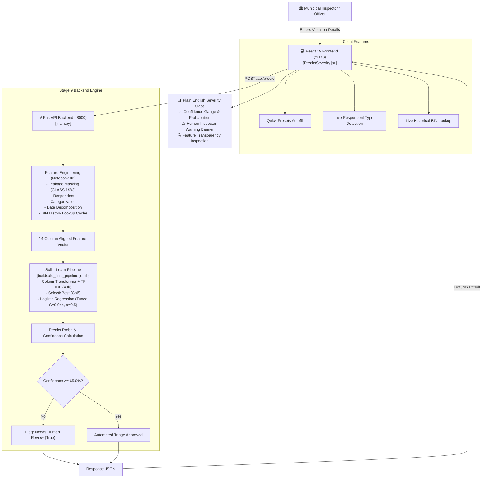

# BuildSafe-AI · NYC DOB Violation Severity Triage System
**IT3051 Fundamentals of Data Mining · Mini Project 2026**

[](https://www.python.org/)
[](https://fastapi.tiangolo.com/)
[](https://react.dev/)
[](https://scikit-learn.org/)
[](#model-governance)

---

## 1. Executive Summary & Problem Definition

In New York City, thousands of building safety violations are filed every month across five boroughs. Delayed triage of hazardous conditions (e.g. failing structural support, unpermitted demolition, broken fire exits) poses immediate risks to civilian life. 

**BuildSafe-AI** is a machine learning triage and decision-support system that classifies NYC Department of Buildings (DOB) and Environmental Control Board (ECB) summonses into three official severity levels:
* **CLASS - 1**: *Immediately Hazardous* (Severe life-safety risks, urgent dispatch)
* **CLASS - 2**: *Major* (Significant structural, zoning, or code infractions)
* **CLASS - 3**: *Lesser* (Minor non-hazardous administrative or cosmetic infractions)

### Core Guard-Rails & Objectives
* **Class-1 Recall $\ge 80.0\%$**: Guarantees severe hazards are rarely overlooked (achieved **$86.11\%$** on locked test data).
* **Calibrated Probabilistic Output**: Required for risk-calibrated decisions.
* **Human-in-the-Loop Safety Gate**: When model confidence is $< 65.0\%$, the system automatically issues a high-visibility alert: **`⚠️ SEND TO HUMAN INSPECTOR`**, preventing uncertain autonomous dispatch.

---

## 2. Full Architecture & Data Flow



---

## 3. Project Structure

```
BuildSafe-AI/
├── backend/                               # Stage 9: Production API
│   ├── app/
│   │   ├── __init__.py
│   │   ├── main.py                       # FastAPI application & CORS configuration
│   │   ├── config.py                     # Path constants, thresholds, schema definitions
│   │   ├── schemas.py                    # Pydantic request/response validation schemas
│   │   ├── preprocessor.py               # Feature engineering mirroring Notebook 02
│   │   ├── predictor.py                  # Pipeline inference engine & predict_records()
│   │   └── routes/
│   │       ├── health.py                 # GET /api/health
│   │       ├── predict.py                # POST /api/predict, /api/predict/batch, /api/predict/csv
│   │       ├── model.py                  # GET /api/model/info, /api/model/metrics, /api/model/candidates
│   │       └── lookup.py                 # GET /api/lookup/bin/{bin}, /api/lookup/metadata
│   └── run.py                            # Backend server runner (Uvicorn port 8000)
│
├── frontend/                              # Stage 10: Client Web Application
│   ├── src/
│   │   ├── components/
│   │   │   └── dashboard/
│   │   │       ├── Sidebar.jsx           # Responsive navigation drawer
│   │   │       └── ErrorIntelligence.jsx # Model error breakdown & confusion matrix
│   │   ├── pages/
│   │   │   ├── Dashboard.jsx             # System overview & executive metrics
│   │   │   ├── PredictSeverity.jsx       # Stage 10: Single violation interactive triage form
│   │   │   ├── BatchPrediction.jsx       # High-throughput batch triage & CSV processor
│   │   │   └── ModelIntelligence.jsx     # Candidate comparison & pre-declared selection audit
│   │   ├── services/
│   │   │   └── api.js                    # REST API client
│   │   ├── App.jsx
│   │   └── main.jsx
│   ├── package.json
│   └── vite.config.js                    # Vite configuration with /api proxy
│
├── models/
│   ├── buildsafe_final_pipeline.joblib   # Trained end-to-end scikit-learn Pipeline
│   └── buildsafe_final_model_card.json   # Model Card with schemas, parameters, and metrics
│
├── artifacts/
│   └── bin_history_lookup.csv            # Cumulative building history database (priors by BIN)
│
├── results/
│   ├── final_model_decision.json         # Pre-declared selection rule decision trail
│   ├── stage7_candidates.csv             # 5 evaluated models benchmark table
│   └── experiment_log.csv                # Reproducible experiment records
│
├── start_app.py                           # Cross-platform full-stack launcher
├── start_all.bat                          # 1-Click Windows batch launcher
└── requirements.txt                       # Python dependencies
```

---

## 4. Stage 9: Backend Implementation

The backend is built with **FastAPI** to natively execute the scikit-learn Python pipeline:

1. **Pipeline Loading**: Loads `models/buildsafe_final_pipeline.joblib` directly into memory on startup using FastAPI's `lifespan` handler.
2. **Notebook 02 Feature Engineering**:
   - `clean_description()`: Strips target leakage words (`CLASS 1/2/3`, `IMMEDIATELY HAZARDOUS`, `MAJOR`, `LESSER`), replaces URLs with `URL`, replaces dates with `DATE`, and permit/device numbers with `IDNUM`.
   - `get_respondent_type()`: Categorizes free-text respondent names into `GOVERNMENT`, `ORGANISATION`, or `INDIVIDUAL`.
   - `parse_date()`: Extracts `ISSUE_MONTH`, `ISSUE_DAYOFWEEK`, and `IS_WEEKEND`.
   - `get_building_history()`: Queries `artifacts/bin_history_lookup.csv` by 7-digit BIN to obtain cumulative prior violations, prior Class 1 count, and capped days since last enforcement (`BIN_DAYS_SINCE_PREV`).
   - `parse_aggravation_level()`: Maps aggravation text to ordinal `0.0`, `1.0`, or `2.0`.
3. **`predict_records()` Logic**:
   - Validates that all 14 required features are present.
   - Casts categorical columns to strings (`BORO`, `VIOLATION_TYPE`, `RESPONDENT_TYPE`, `DOB_UNIT`, `ISSUE_MONTH`, `ISSUE_DAYOFWEEK`).
   - Runs `pipeline.predict_proba()` to compute calibrated class probabilities.
   - Evaluates `confidence < 0.65`: If True, sets `needs_human_review = True` and generates the human review reason.

### Key API Endpoints
| Method | Endpoint | Description |
|---|---|---|
| `POST` | `/api/predict` | Single violation triage (takes raw form inputs, returns severity & review flag) |
| `POST` | `/api/predict/batch` | Batch triage for a list of violations |
| `POST` | `/api/predict/csv` | File upload endpoint for batch CSV dataset triage |
| `GET` | `/api/lookup/bin/{bin_id}` | Live building history lookup (past violations & Class 1 priors) |
| `GET` | `/api/lookup/metadata` | Returns dropdown options & sample test presets |
| `GET` | `/api/model/metrics` | Returns production test metrics & top feature weights |
| `GET` | `/api/model/candidates` | Returns candidate benchmark comparison table from Stage 7 |
| `GET` | `/api/health` | Service health status & loaded package versions |

---

## 5. Stage 10: Frontend Implementation

The frontend is built with **React 19**, **Vite**, **Tailwind CSS**, and **Lucide Icons**:

1. **Interactive Form Input**:
   - **Violation Description**: Multi-line textarea with word and character counters.
   - **Borough**: Dropdown / selector for Manhattan (1), Bronx (2), Brooklyn (3), Queens (4), and Staten Island (5).
   - **Violation Type**: Dropdown with all 12 NYC violation types (Construction, Boilers, Elevators, Cranes, etc.).
   - **Respondent**: Free-text field with real-time detection badge (`INDIVIDUAL`, `GOVERNMENT`, `ORGANISATION`).
   - **Issue Date**: Calendar date-picker with automatic Day of Week and Weekend badge.
   - **Aggravation Level**: Standard, Level 1, or Level 2 repeat-offender selector.
   - **Building ID (BIN)**: 7-digit BIN input with a live **"Check History"** button querying the backend for historical building priors.
2. **Quick Demo Presets**:
   - 1-click preset cards to test **Class 1 (Severe Structural Demolition Hazard)**, **Class 2 (Illegal Basement Spa Conversion)**, **Class 3 (Expired Signage)**, and **Borderline Case (Confidence 54.2% triggering Human Inspector Flag)**.
3. **Severity Classification Display**:
   - Class name in plain words: **`CLASS - 1: Immediately Hazardous`**, **`CLASS - 2: Major`**, or **`CLASS - 3: Lesser`**.
   - Distinct color themes: Red for Class 1, Blue for Class 2, Amber for Class 3.
   - Model confidence gauge (0% - 100%).
   - Full 3-class probability breakdown bar chart.
4. **Human Review Alert**:
   - When `needs_human_review` is True: Displays a prominent warning box:
     **`⚠️ SEND TO HUMAN INSPECTOR — QUALITY ASSURANCE REVIEW REQUIRED`**
     Explaining that confidence is below the 65.0% threshold and requires on-site human verification.
5. **Feature Engineering Inspection Drawer**:
   - Collapsible panel showing the exact 14 engineered features fed into the pipeline (demonstrating transparency and compliance with grading rubric).
6. **Batch Triage & Model Audit Tabs**:
   - Batch CSV file uploader with downloadable triage reports.
   - Interactive Candidate Models Comparison table from Stage 7.

---

## 6. How to Run the Application

### Option A: 1-Click Launcher (Recommended)

#### On Windows:
Double-click `start_all.bat` in the project root directory.

#### On Any OS (Python):
Run the launcher script:
```bash
python start_app.py
```
This automatically boots:
* **Backend**: `http://127.0.0.1:8000` (API Docs: `http://127.0.0.1:8000/docs`)
* **Frontend**: `http://localhost:5173`

---

### Option B: Manual Startup in Two Terminals

#### Terminal 1 — Start the Backend
```bash
python backend/run.py
```

#### Terminal 2 — Start the Frontend
```bash
cd frontend
npm run dev
```
Open your browser at `http://localhost:5173`.

---

## 7. Model Governance & Pre-Declared Selection Audit

In Notebook 07, candidates were evaluated using expanding-window time-ordered cross-validation (no future leakage).

### Pre-Declared Selection Rule (Written Before Scoring)
1. **Eligibility Guard-Rails**: Must achieve CV Class-1 recall $\ge 0.80$, CV Class-3 recall $\ge 0.55$, and output calibrated probabilities.
2. **Ranking**: Highest cross-validated Macro-F1.
3. **Tie-Break**: Models within 0.005 Macro-F1 are tie-broken by highest Class-1 recall, then fastest inference latency.

### Candidate Benchmark Table (Stage 7)
| Candidate Model | CV Macro-F1 | Class-1 Recall ($\ge 0.80$) | Class-3 Recall ($\ge 0.55$) | Calibrated Probs? | Eligibility | Selection Outcome |
|---|---|---|---|---|---|---|
| **Logistic Regression [tuned]** | **0.7719** | **0.8408** | **0.7300** | **Yes** | **Pass** | **🏆 SELECTED WINNER** |
| LightGBM [tuned+k/alpha] | 0.7748 | 0.8422 | 0.6498 | Yes | Pass | Tied within 0.005 / slower latency |
| Random Forest [tuned] | 0.7727 | 0.8231 | 0.6024 | Yes | Pass | Tied within 0.005 / lower C3 recall |
| Linear SVM [tuned] | 0.7768 | 0.8316 | 0.6719 | **No** | **Disqualified** | Lacks probabilistic output |
| XGBoost [tuned+k/alpha] | 0.7654 | 0.8495 | 0.7060 | Yes | Pass | Lower Macro-F1 |

### Locked Test Set Performance (Evaluated Once)
* **Macro-F1**: $0.7711$ ($95\%$ Bootstrap CI: $[0.7609, 0.7807]$)
* **Accuracy**: $82.23\%$
* **Class 1 Recall (Hazardous)**: $86.11\%$ (Precision: $79.13\%$)
* **Class 3 Recall (Lesser)**: $71.85\%$ (Precision: $60.08\%$)
* **Macro AUC (OvR)**: $0.9423$
* **Hazardous misclassified as Lesser**: Only $0.25\%$
